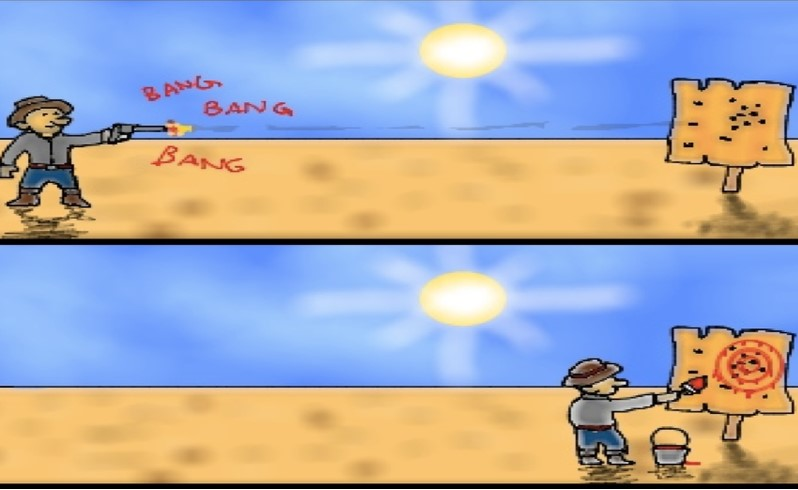

```{r setup, include=FALSE}
knitr::opts_chunk$set(echo = FALSE)
```

## Data Provenance

Where does your data come from? Is it a trustworthy source? Is it what it claims to be?

Make sure you aren't overgeneralizing; if you look at temperature records in Detroit, Michigan and there hasn't been a warming trend over the past decade, you can't say global warming doesn't exist.


## Project Proposal Concerns

- Too narrow
- No real-time data
- No data source
- No research question (too broad)

From a speaker the other night

*"Don't be happy with the data you have. Go get the data you need"*

## Give context

Instead of just showing some numbers, try to explain why you think trends in data are happening. Use your knowledge of the topic, use supplemental data sets, whatever you need

## Data Dredging

When you test a hypothesis compared to the null with $/alpha$ = 0.05, that means any time the null hypothesis is actually true you have a 5% chance of rejecting it.

If you go into a problem with a lot of data and no clear question, you can easily test 20 or 50 or 100 hypothesis and obtain p-values for them. Even if there's nothing there, you'll see "statistical significance" a few times

Better is to go in with domain-specific reasons why you want to test certain hypotheses, and then test only those

## Texas Sharpshooter Fallacy



## Significance

## Significance

A statistical hypothesis test is not the end of discussion.

- Statistical significance != practical significance. Large enough sample size basically guarantees stat. sig. but it may not be enough to really matter

- Not statistically significant might still be enough to matter

- In regression models, just because a variable isn't significant doesn't mean you should ignore it. Sometimes it's very informative to say that something was not significant


