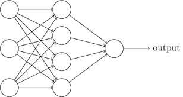

```{r setup, include=FALSE}
knitr::opts_chunk$set(echo = FALSE)
```

## Deep Learning

What the heck is it

(other than a popular buzzword)

## Neural Networks



A neural network with a single (hidden) layer basically just does a regression. Each unit (neuron) is one variable, and the weight is basically the coefficient for that variable in the linear regression.

More layers allow the model to "learn" nonlinear relationships.

## Backpropagation and Gradient Descent

These are terms you'll see a lot if you read into neural networks. Doing a regression (even a complicated one) is an optimization problem. You want to find coefficients (or neural network weights) that make the best fit model.

How do you know how well a model fits? By some kind of loss function, so we minimize loss to find the best model.

Gradient descent is how you do this optimization. If you remember your calculus, gradients are derivatives. They tell you which way to go if you want to increase (or decrease) the value of a function.

Backpropagation is the specific way the gradient descent is implemented in neural networks

## Deep Learning (again)

"Deep" refers to having many (maybe even dozens or hundreds) of hidden layers


There are many different kinds of neural network designs, in terms of the number of layers, number of connections between layers, and the kind of neuron units themselves

## Convnets and RNNs

Convolutional neural networks are usually the best-performing options for image classification. Very roughly speaking, a "convolution" means that any recognized shape gets tracked anywhere across the image

Recurrent neural networks are used for sequential data. RNNs have a memory instead of just remembering the last thing they had for input. Better performing variants are Long Short Term Memory units (LSTM) and Gated Recurrent Units (GRU)